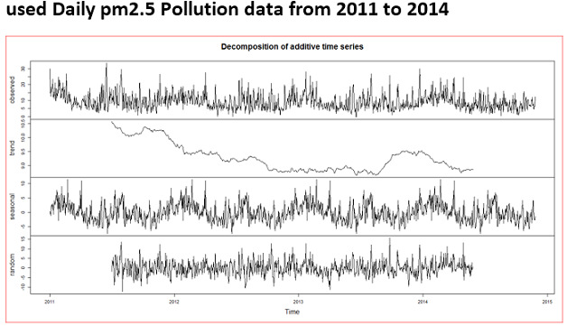
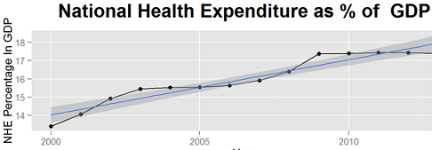

IS607 Final Project Summary
========================================================
author: Jamey, Sreejaya, Suman
date: 05/25/2015

Healthcare Expenses, Air Pollution in US

Proposal
========================================================

**"US Air Pollution Data and Health Care Expenditure Data"**    

   Acquire & Perform exploratory data analysis on the annual air pollution, Health Expenditure Data in United States. And compare these data sets by performing basic regression analysis.

- Annual Air Pollution Data
http://aqsdr1.epa.gov/aqsweb/aqstmp/airdata/download_files.html

- Annual Healthcare Expenditure data 
http://www.cms.gov/Research-Statistics-Data-and-Systems/Statistics-Trends-and-Reports/NationalHealthExpendData/NationalHealthAccountsHistorical.html

Motivation & Objectives
========================================================

- Exploring various packages in R to acquire, tidy, clean, transform, reshape etc.
- Extract the Annual Air pollution data & health expenditure data.
- Clean , Tidy and Transform the data - Hadley Wickham's Grammar of Data Science
- Exploratory data analysis.
- Load the data sets into Neo4j (Or MongoDB) and analyse.
- Basic Regression analysis between the pollution data set Vs health expenditure data sets.

Exploratory Data Analysis - Healthcare Expenditure stats
========================================================

- The focus of analyses is to find out whether the health care expenses are aligned with some sort of trend or economical facts since the expenditures have been bubbled and still skyrocketing.
- Cluster analyses are chosen to uncover subgroups of healthcare expenditure behavior with any cohesive pattern among the observations.
- From clustering, we concluded that if the expenditures are based on one fact, inflation, it shouldn't be clustered in three different subgroups. - Especially, certain variables' standardized values are higher than others meaning there are more causes than inflation for the increased expenses.

Exploratory Data Analysis - Healthcare Expenditure stats
========================================================

- Clustering the variable itself to find out what are cause of the each variables cost increase would be the next analyses. By digging the cause of increased expenses from top to bottom, we should find out the real issue of complicated health care cost and can fix the problem.

[Right click & Open - Clustering Analysis](http://rpubs.com/JameyE/83458)

Exploratory Data Analysis - Pollution Concentration Study
=========================================================

- Data Acquisition & Tidying 
- Pollutant Concentration on the Map
- State wise analysis of sample pollutants

[Right click & Open - Pollution Concentation Study](http://rpubs.com/snair/US-Airpollution_Concentration_Study)

Time Series Analysis - Pollution Data
=======================================

- PM2.5 Particles in Daily Pollution Data From 2012-14 in "Queens, NY"
- Used "xts" package and ts function from base R for the time series analysis 

Time Series Analysis - Decomposing  Seasonal Pollution Data
===========================================================

- To estimate the trend component and seasonal component of a seasonal time series that can be described using an additive model, we can use the "decompose()" function in R. This function estimates the trend, seasonal, and irregular components of a time series that can be described using an additive model

Load the Pollution data into Neo4J & Review
=========================================================

- Data Acquisition & Tidying 
- Extract & Transform the required data into csv files
- Load the csv files into neo4j and review

[Right click & Open - Neo4J Data Preparation & Analysis](http://rpubs.com/pskumar/IS607Final_Neo4JDA)

Regression Analysis 
=====================================================================================
 - Annual Health Expenditure Vs GDP data
 - Annual Health Expenditure Vs Pollution data
 
[Right click & Open - Basic Regression Analysis](http://rpubs.com/pskumar/IS607Final_RegressionAnalysis)
  

Reference Links
========================================================

__github__

https://github.com/srajeev1/607FinalProject

__rpubs__

http://rpubs.com/JameyE/83458

http://rpubs.com/snair/US-Airpollution_Concentration_Study

http://rpubs.com/pskumar/IS607Final_Neo4JDA

http://rpubs.com/pskumar/IS607Final_RegressionAnalysis
